<!-- START doctoc generated TOC please keep comment here to allow auto update -->
<!-- DON'T EDIT THIS SECTION, INSTEAD RE-RUN doctoc TO UPDATE -->
**Table of Contents**  *generated with [DocToc](https://github.com/thlorenz/doctoc)*

- [Managing Arbitrary Kubernetes Resources Using Crossplane Provider](#managing-arbitrary-kubernetes-resources-using-crossplane-provider)
  - [About Provider Kubernetes](#about-provider-kubernetes)
  - [Why Provider Kubernetes](#why-provider-kubernetes)
  - [Enhanced Provider Kubernetes](#enhanced-provider-kubernetes)
    - [About The Demo Project](#about-the-demo-project)
    - [Unmanaged External Ressource](#unmanaged-external-ressource)
    - [Resource Management Policy](#resource-management-policy)
    - [ClusterServiceVersion Name](#clusterserviceversion-name)
    - [Generic References](#generic-references)
    - [Install Order](#install-order)
    - [Uninstall Order](#uninstall-order)
    - [Using Finalizers](#using-finalizers)
  - [Summary](#summary)

<!-- END doctoc generated TOC please keep comment here to allow auto update -->

# Managing Arbitrary Kubernetes Resources Using Crossplane Provider

This document is aimed to explain how to manage arbitrary Kubernetes resources using Crossplane provider and how to enhance the provider by adding new features such as **resource management policy** and **resource reference** to manage Kubernetes resources more effectively.

## About Provider Kubernetes

The Crossplane Provider [provider-kubernetes](https://github.com/crossplane-contrib/provider-kubernetes) is designed to enable deployment and management of arbitrary Kubernetes resources in clusters. It defines an `Object` resource type which represents arbitrary Kubernetes resources, then uses a Kubernetes controller to reconcile `Object` typed resources to manage the corresponding Kubernetes resources.

As an example, below YAML manifest defines an `Object` which represents a Kubernetes namesapce.

```yaml
apiVersion: kubernetes.crossplane.io/v1alpha1
kind: Object
metadata:
  name: sample-namespace
spec:
  forProvider:
    manifest:
      apiVersion: v1
      kind: Namespace
      metadata:
        # name in manifest is optional and defaults to Object name
        # name: some-other-name
        labels:
          example: "true"
  providerConfigRef:
    name: kubernetes-provider
```

The detailed manifest for the namespace is defined in `spec.forProvider.manifest`. So, essentially, `Object` resource simply wraps the manifest of target Kubernetes resource, in this case the namespace. After `Object` resource is created, the provider will also watch the target Kubernetes resource and attach the runtime copy for the manifest including runtime status to the `Object` resource at `status.atProvider.manifest` so that we can monitor the target Kubernetes resource by checking the `Object` status field. 

By convention in Crossplane, we usually call `Object` as managed resource, and the target Kubernetes resource as external resource. The managed resource `Object` is always co-located with the provider so that it can be watched by the provider. The external resource can be either co-located with the provider on the same cluster, or on a remote cluster, depending on the kubeconfig information defined in `spec.providerConfigRef` as above. Typically, the provider will check if the external resource exists on the target cluster, and if does not, it will create for us.

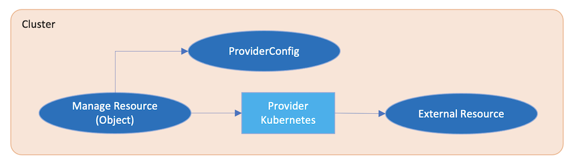

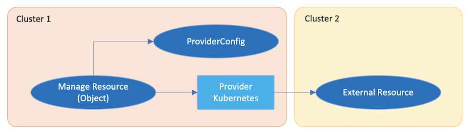

## Why Provider Kubernetes

When using Provider Kubernetes, you may think that it does not add too much value if it just wraps Kubernetes resource manifest as `Object` then does the transformation between the `Object` resource and the actual Kubernetes resource. This is because user can manage Kubernetes resource directly without using `Object` and the provider. They can manage Kubernetes resource either manually using command line tool such as kubectl or programmatically using normal Kubernetes controller.

It also does not add too much value when we compose `Object` with other resources managed by other providers in a Crossplane `Composition` resource. This is because, instead of defining `Object` resources in a `Composition`, we can define the actual Kubernetes resources in `Composition` directly.

Now the question comes up. Why we need Provider Kubernetes and `Object` if we can manipulate Kubernetes resource directly? The answer is no you needn't, unless you need more powerful features to manage Kubernetes resource. Start from next section, I will share with you my recent research findings on how an enhanced version of Provider Kubernetes can bring more values to the deployment and management of arbitrary Kubernetes resources, by leveraging some new features such as resource management policy and resource reference.

## Enhanced Provider Kubernetes

The enhanced Provider Kubernetes provides a couple of new features to help you manage arbitrary Kubernetes resources more effectively：

* It allows you to define fine-grained resource management policy to instruct the provider how to manage Kubernetes resources.
* It allows you to define resource references for current `Object` as dependencies to retrieve values from dependant resources at runtime and guarantee the resource rendering in a specified order.

Note: These new features are implemented in [my personal git repository](https://github.com/morningspace/provider-kubernetes) now which is forked from [the upstream repository](https://github.com/crossplane-contrib/provider-kubernetes) in Crossplane community. It
has not been merged into the community version yet.

In order to better understand how these features can help to manage Kubernetes resources, I will use a demo project called [capabilities-shim](https://github.com/morningspace/capabilities-shim) to describe the problems that I experienced and how the enhanced provider can help to address these problems.

### About The Demo Project

The project `capabilities-shim` is aimed to demonstrate the composing of software capabilities from different applications to build user-oriented solution. It leverages the powerful Crossplane composition engine, the Provider Kubernetes, along with other cloud native install methods run at back end such as Operator Lifecycle Manager (OLM) to provision the actual workloads in a declarative way.

The project defined a couple of sample capabilities that can be installed:

* `Networking` capability to privion a Kong proxy as an API Gateway.
* `Logging` capability to provision an Elasticsearch and Kibana instance for logging storage and visualization.
* `All` capability to compose all the above capabilities as an all-in-one delivery.

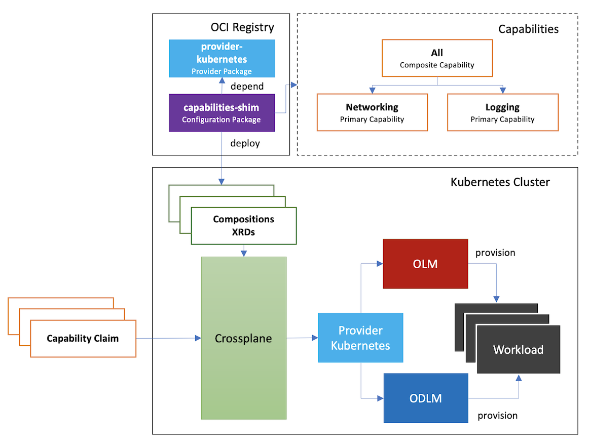

In this document, I will use `capabilities-shim` with the help of Provider Kubernetes and OLM to provision `Networking` capability.

Firstly, let's run below command to launch the demo environment:

```console
demo/install.sh
```

Then, run below command to install `Networking` capability:

```console
kubectl apply -f demo/examples/networking/olm.yaml
```

Before we use the enhanced provider, this will launch both the Kong operator pod and the Kong pod, also all managed resources handled by Provider Kubernetes and external resources handled by OLM:

* For managed resources, there are two `Object` resources where one represents the `Subscription` resource and the other one represents the `Kong` resource. The creation of managed resources will trigger the creation of external resources which is handled by Provider Kubernetes.
* For external resources, as the `Subscription` resource is created, it triggers the creation of the `ClusterServiceVersion` resource, then the `InstallPlan` resource, which triggers the launch of Kong operator pod. Then, the creation of `Kong` resource will be detected by Kong operator pod and ultimately triggers the launch of Kong pod.

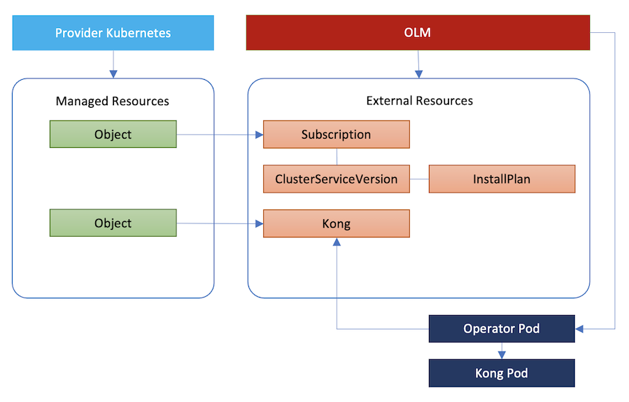

Everything works perfect, isn't? Now let's go through the uninstall process and see where the problems are.

### Unmanaged External Ressource

To uninstall the capability can be done by simply deleting the corresponding Composite Resource Claim(XRC) for the capability:

```console
kubectl delete networkingclaim my-networking-stack
```

This triggers the deletion of managed resources, i.e. the `Object` resources, then the deletion of external resources, in this case, the `Subscription` and `Kong` resource. This triggers the deletion of the Kong pod since `Kong` resource is deleted.

However, as the `ClusterServiceVersion` resource still exists, so does the `InstallPlan` resource, the Kong operator pod still remains. This is considered as not a clean uninstall since some garbage resources remain in the cluster.

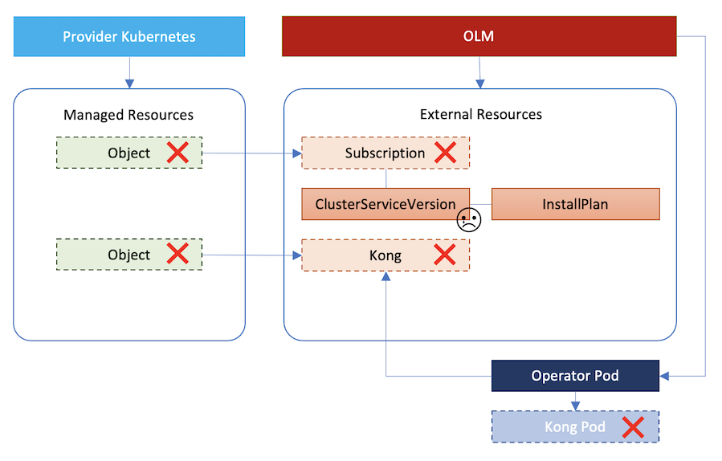

We call the external resource such as `ClusterServiceVersion` and `InstallPlan` in this case are **unmanaged external resources** which means these resources should have been managed by the provider, so that when the managed resource is deleted, the corresponding external resource will be deleted accordingly.

Apparently, the solution to this problem is turning unmanaged external resource into managed one. In our case, this can be done by defining an `Object` resource to represent the `ClusterServiceVersion` resource. Then, the deletion of `Object` resource will trigger the deletion of `ClusterServiceVersion` resource. There is no need to define `Object` for `InstallPlan` because when `ClusterServiceVersion` is deleted, it will trigger the deletion of `InstallPlan` automatically which is handled by OLM.

One interesting thing for the `Object` resource to be defined is that, the provider only needs to take care of the deletion and observation for the `ClusterServiceVersion` resource. It should not be responsible for the creation and update because these operations are handled by OLM. This scenario leads to the introduction of the feature **Resource Management Policy** in Provider Kubernetes.

### Resource Management Policy

The resource management policy is used to instruct the provider to manage Kubernetes resources in a fine-grained way. Given that:

* To manage an external resource that can not be observed is usually meaningless.
* Create and update are usually coupled together.

We only need 4 types of management policies:

| Observe | Create & Update | Delete | Management Policy      | Memo
|:--------|:----------------|:-------|:-----------------------|:----
| Y       | Y               | Y      | Default                | The provider can fully manage the resource. This is the default policy.
| Y       | Y               | N      | Undeletable            | The provider can observe, create, or update the resource, but can not delete it. 
| Y       | N               | Y      | ObservableAndDeletable | The provider can observe or delete the resource, but can not create and update it.
| Y       | N               | N      | Observable             | The provider can only observe the resource. This maps to the read-only scenario where the resource is fully controlled by third party application and the provider only reads the status of the resource.

The idea of Resource Management Policy is actually expanded from the concept of `DeletionPolicy` in Crossplane which can be found in Crossplane code:

```go
const (
    // DeletionOrphan means the external resource will orphaned when its managed
    // resource is deleted.
    DeletionOrphan DeletionPolicy = "Orphan"

    // DeletionDelete means both the external resource will be deleted when its
    // managed resource is deleted.
    DeletionDelete DeletionPolicy = "Delete"
)
```

The `DeletionOrphan` policy is actually equivalent to the `Undeletable` resource management policy.

Now, let's define policy for our `Object` resource that represents the `ClusterServiceVersion` resource. In our case, we should use `ObservableAndDeletable` policy. Because the policies in the enhanced provider are implemented as Kubernetes annotations, you just need to specify the policy by adding an annotation to the `Object` resource. For example:

```yaml
apiVersion: kubernetes.crossplane.io/v1alpha1
kind: Object
metadata:
  name: csv-kong
  annotations:
    kubernetes.crossplane.io/managementType: "ObservableAndDeletable"
spec:
  forProvider:
    manifest:
      apiVersion: operators.coreos.com/v1alpha1
      kind: ClusterServiceVersion
      metadata:
        namespace: operators
```

This will tell the provider not to create and update the `ClusterServiceVersion` resource, but can delete the resource during uninstall, so that it can trigger the deletion of `InstallPlan` and the Kong Operator pod.

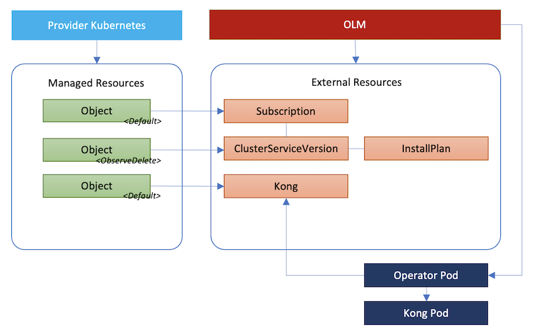

### ClusterServiceVersion Name

In the above `Object` resource definition, you may notice when we define the manifest for `ClusterServiceVersion` resource in `spec.forProvider.manifest`, it has no name specified. This is because the name can only be determined at runtime. After the `Subscription` resource is created, the name can be retrieved from `status.currentCSV` in the `Subscription` resource. This means you cannot simply specify a fixed name for the `ClusterServiceVersion` resource when you define the `Object` resource. We need a mechanism that can tell the provider to resolve the name dynamically at runtime.

### Generic References

To address such a problem, we can leverage the idea of **Generic References** which is currently a [design proposal](https://github.com/crossplane/crossplane/pull/2385) under discussion in Crossplane community.

As it states in the design document, it is aimed to address the scenario where managed resource requires information that is not available when user creates the resource. For example, to create a Subnet, you need to supply a VPC ID. If you create the VPC at the same time, then the ID will be available only after the creation.

According to the proposal, all managed resources will have a top-level spec field that lists the generic references. They will be resolved in order and failure of any one will cause reconciliation to fail.

Below is a sample snippet for a managed resource which has a reference to another managed resource:

```yaml
spec:
  patches:
  - fromObject:
      apiVersion: ec2.aws.crossplane.io/v1alpha1
      kind: VPC
      name: main-vpc # optional, matchLabels can be used instead.
      fieldPath: spec.forProvider.cidrBlock
    toFieldPath: spec.cidrBlock
```

And, this one is a reference to a namespaced Kubernetes resource.

```yaml
spec:
  patches:
  - fromObject:
      apiVersion: v1
      kind: ConfigMap
      name: common-settings
      namespace: crossplane-system
      fieldPath: data.region
    toFieldPath: spec.forProvider.region
```

Although this design has not been closed yet, a similar idea has been implemented in the enhanced provider. When define an `Object` resource, it allows you to specify one or more references in `spec.references` using exactly the same syntax as it is defined in the above design.

In our case, when define `Object` for `ClusterServiceVersion` resource, you need to define a reference to `Subscription` so that the `ClusterServiceVersion` name can be retrieved from `Subscription` at the field path `status.atProvider.manifest.status.currentCSV` when it is created, then apply the value to `Object` as the `ClusterServiceVersion` name at `spec.forProvider.manifest.metadata.name`:

```yaml
apiVersion: kubernetes.crossplane.io/v1alpha1
kind: Object
metadata:
  name: csv-kong
  annotations:
    kubernetes.crossplane.io/managementType: "ObservableAndDeletable"
spec:
  references:
  - fromObject:
      apiVersion: kubernetes.crossplane.io/v1alpha1
      kind: Object
      name: sub-kong
      fieldPath: status.atProvider.manifest.status.currentCSV
    toFieldPath: spec.forProvider.manifest.metadata.name
  forProvider:
    manifest:
      apiVersion: operators.coreos.com/v1alpha1
      kind: ClusterServiceVersion
      metadata:
        namespace: operators
```

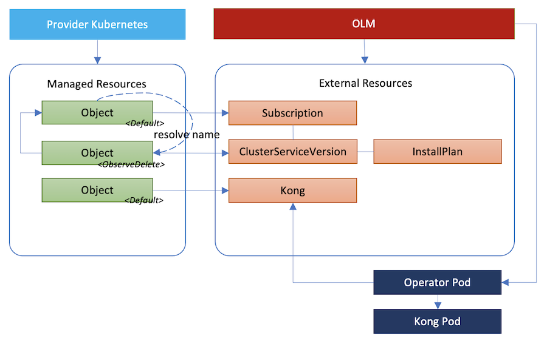

### Install Order

When one managed resource has references to other resources, the provider will block any operation against the current resource until all referenced resources are resolved. This is a very important feature in a typical install scenario where the provider is instructed to create multiple `Object` resources and some `Object` resources require to be created before or after others. So, the references that we define for the resources to be created can help to guarantee the overall install order.

In our case, the `Subscription` resource needs to be created before the `ClusterServiceVersion` resource and the `Kong` resource needs to be created after the `ClusterServiceVersion` resource. As a result, `Kong` depends on `ClusterServiceVersion`, then `ClusterServiceVersion` depends on `Subscription`. This dependency chain can be defined by specifying the reference on each `Object` being involved.

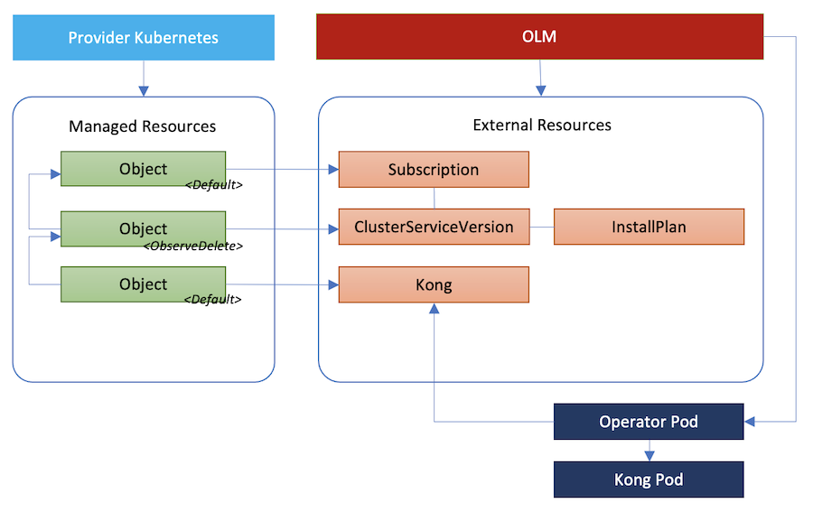

### Uninstall Order

To define the dependency chain using references can guarantee the install order. But, it does not guarantee the uninstall order. Let's take the deletion of `Networking` capability as an example, and see what happens when we delete the resource claim for the capability.

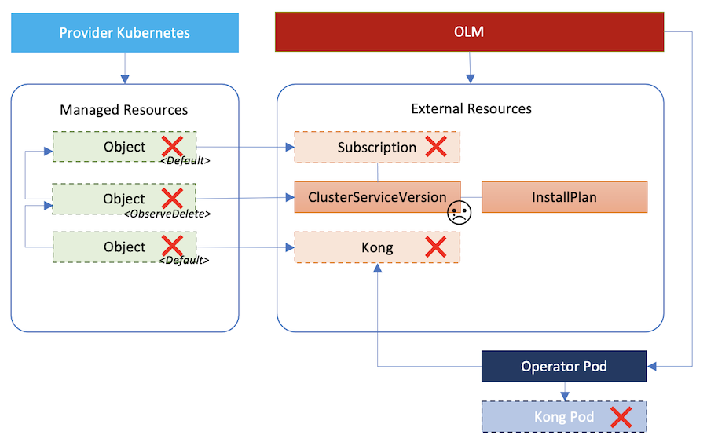

By default, the provider will delete all `Object` resources in paralell after the resource claim is deleted. This triggers the deletion of the corresponding external resources and they will be deleted in paralell too. In some cases, the `Subscription` resource can be deleted earlier than the `ClusterServiceVersion` resource. This will cause the `ClusterServiceVersion` resource failed to delete as it requires the `Subscription` resource which has already been deleted. So, the resource deletion should also follow a specific order, i.e. the uninstall order. It is usually the reverse order as opposed to the install order.

### Using Finalizers

In order to guarentee the uninstall order, the enhanced provider adds finalizer to each dependent external resource when it resolves the reference to that external resource.

In our case, when the provider resolves the resource references, the `Object` resource for the `Kong` resource has a reference to the `Object` resource for the `ClusterServiceVersion` resource, so the provider adds a finalizer to `ClusterServiceVersion`, which is the dependent resource of `Kong`. Similarly, it adds a finalizer to `Subscription` since `ClusterServiceVersion` depends on `Subscription`.


When a managed resource and its external resource are deleted, the provider will remove the finalizers from its dependent external resources.

In our case, after all `Object` resources are deleted, the `Kong` resource will be deleted at first, so that the `Kong` pod will be deleted.

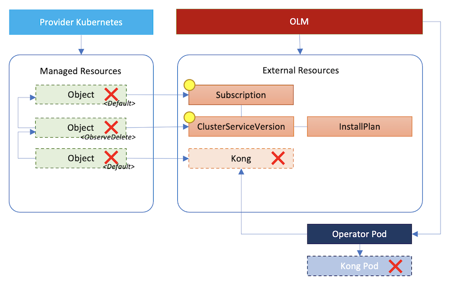

During the time when the `Object` resource for `Kong` is deleted, it also removes the finalizer from its dependent external resource, the `ClusterServiceVersion` resource. This triggers the actual deletion of the `ClusterServiceVersion` resource, then the deletion of `InstallPlan`. As a result, the Kong operator will be deleted.

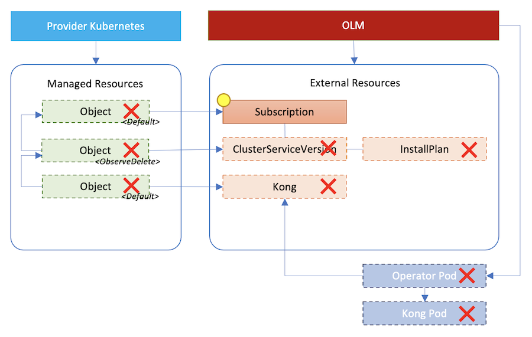

Now that the `Object` resource for `ClusterServiceVersion` is deleted, it also removes the finalizer from its dependent external resource, the `Subscription` resource. Ultimately, all resources involved in `Networking` capability will be deleted. This leaves the cluster in a clean state after the uninstall process is completed.

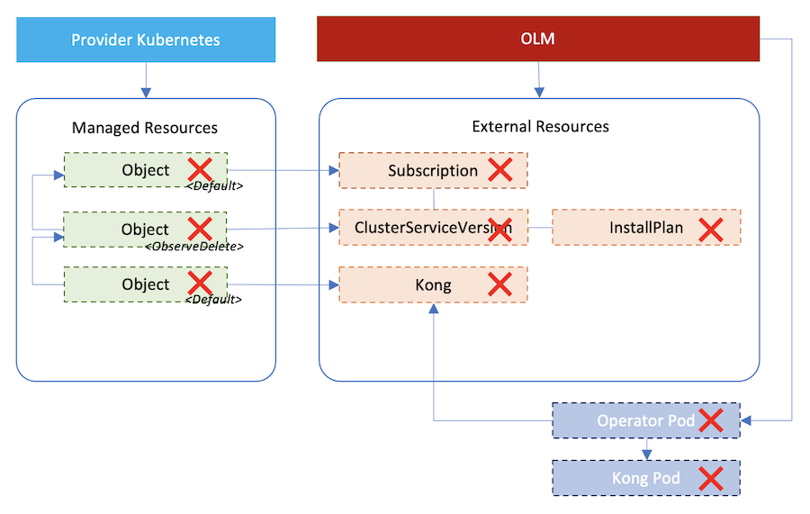

## Summary

The enhanced Provider Kubernetes introduced some interesting features that can help to manage arbitrary Kubernetes resources more effectively. It also brings more values to the provider and broarden the scope where the provider can be applied.

With the help of Provider Kubernetes, different backends such as OLM, Helm, and so on that provision the actual workloads in Kubernetes cluster can be integrated into the Crossplane world easily as long as these backends work in a Kubernetes native way, i.e. driven by Kubernetes Customer Resource.

Thus, we can drive the backends by creating `Object` resources that represent the corresponding customer resources watched by these backends, manage them using fine-grained policy, define references to resolve metadata at runtime, and ensure the install/uninstall order centrally and consistently. 

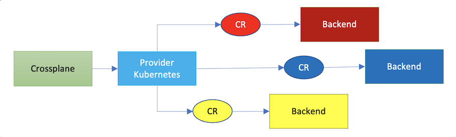

One more additional value by using enhanced Provider Kubernetes is that some features such as resource references that have not been implemeted in Crossplane core yet can be added at provider level. It tells us that if you want to try a feature but cannot wait until it can be accepted and added in Crossplane core in its official release, or even worse that may never get chance to go into Crossplane core, it would be much better to implement it in provider rather than fork the Crossplane core and modify the core directly. This is because it may be hard to track and upgrade to the following Crossplane releases based on a forked version if you want some features that are only available in the coming releases.